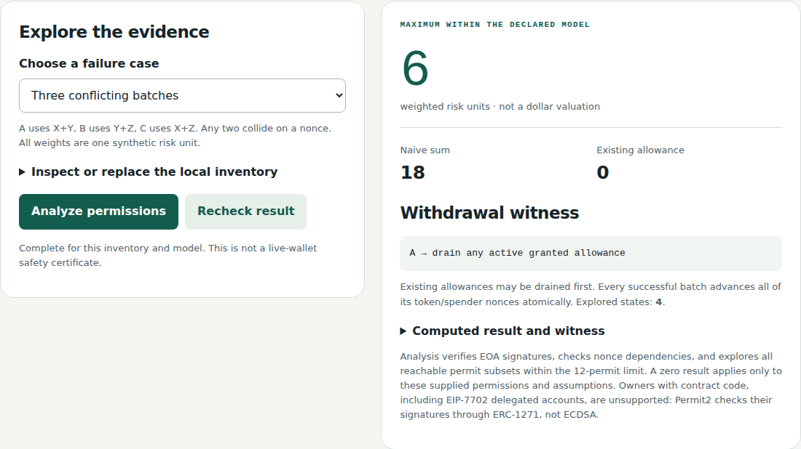
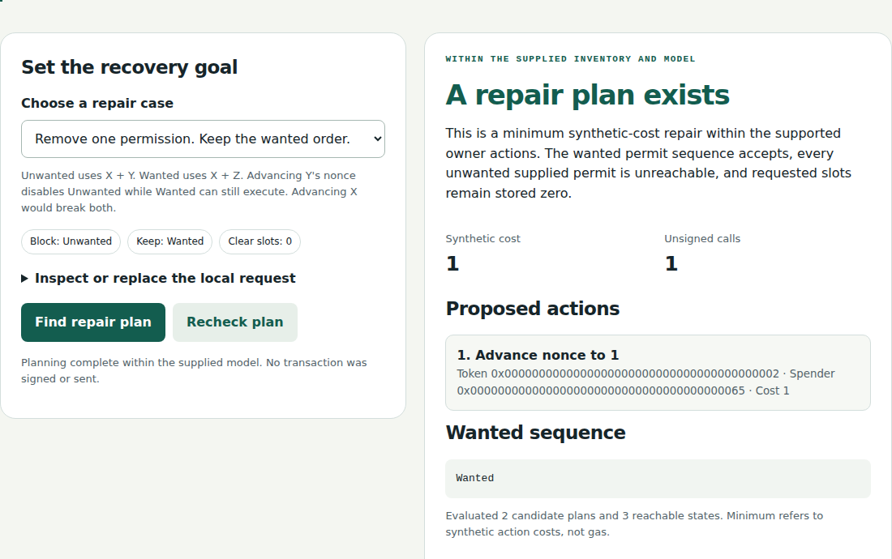

# Korp: Permit2 Exposure Map and Repair Planner

**See what your signed Permit2 approvals can really take, and find the cheapest way to cancel the ones you no longer want without breaking the ones you do.**

Everything runs in the browser from unsigned data. Nothing connects to a wallet, signs or broadcasts. This is AI-assisted research code and has not been audited.

[Open the Exposure Map](https://korp-txcert-live-testnet.mute-cell-557f.workers.dev/exposure) · [Open the Repair Planner](https://korp-txcert-live-testnet.mute-cell-557f.workers.dev/repair)

## The problem in one example

You signed three Permit2 batches for the same spender. Batch A covers tokens X and Y, batch B covers Y and Z, and batch C covers X and Z. Each one grants 6 units.

| How you count it | Exposure |
| --- | --- |
| Add up every signature | 18 |
| Take the largest grant per token and nonce | 9 |
| **What Permit2 actually allows** | **6** |

Any two of these batches reuse the same token nonce, so only one of them can ever execute. The Exposure Map follows Permit2's real nonce rules and returns the true maximum, plus a withdrawal order that achieves it.

Now say you want to cancel a batch using X + Y but keep one using X + Z. Invalidating X's nonce would kill both. Invalidating Y's nonce kills only the unwanted one. The Repair Planner finds that choice for you and outputs the unsigned `invalidateNonces` calldata.





## How it works

**Exposure Map** ([source](src/research/permit-exposure.ts) · [research notes](docs/research/EXPOSURE-RESEARCH.md))

- It verifies each batch's EIP-712 signature against the owner, chain and Permit2 address. Both 65-byte and 64-byte (EIP-2098) signatures are accepted.
- It explores every reachable order of up to 12 batches. Each batch advances all of its token nonces at once, so this is at most 4,096 states.
- It counts existing allowances, grants that are unlocked by earlier ones, and zero or expired grants that only move a nonce forward. Nonce cycles that block every batch are handled correctly.
- It returns the maximum, a witness order and the naive totals for comparison. Anyone can recompute the result and replay the witness. An altered maximum is rejected.

**Repair Planner** ([source](src/research/permit-repair.ts) · [research notes](docs/research/REPAIR-PLANNER.md))

- It chooses a final nonce for each token and spender pair, and it locks down any stored allowance you asked to clear.
- It only needs to try the current nonce, each signed nonce and each signed nonce + 1. Any other value blocks a slot in exactly the same way, so this search is complete.
- Raising a nonce can **unlock** a later signature, so every candidate is checked against every order of the supplied batches.
- The result is the cheapest plan in declared synthetic cost units (not gas), or a specific explanation of why no plan exists. If a request exceeds the search limits, it fails with an error instead of being reported as impossible.
- The planner's calls were executed against the pinned official Permit2 `AllowanceTransfer` contract on a local EVM ([evidence](docs/research/permit-repair-chain.json)). No public-chain transactions were made.

## Run it locally

Use Node 24 (see `.nvmrc`). Node 22 also works but prints SQLite "experimental" warnings.

```sh
npm ci --ignore-scripts
npm run check   # SDK build, typecheck, lint and 238 tests
```

To reproduce the research results:

```sh
node --import tsx scripts/research/exposure-fixtures.ts   # public exposure examples
node --import tsx scripts/research/repair-fixtures.ts     # public repair examples
node --import tsx scripts/research/build-exposure.ts      # browser bundles
node --import tsx scripts/research/build-repair.ts
```

The local EVM harnesses are `scripts/research/permit-exposure-chain.ts` and `scripts/research/permit-repair-chain.ts`. [`scripts/research/permit2-reference/`](scripts/research/permit2-reference/README.md) documents the pinned Permit2 source and setup. The public examples use deliberately expired synthetic signatures and include no private keys.

## Limits

Read these before trusting a result.

- **Timing:** every repair must land before anyone else acts. Separate transactions are not atomic, and an attacker can act first or between calls.
- **Smart-account owners are not supported.** Permit2 checks signatures with ECDSA only when the owner address has no code. Contract wallets and EIP-7702 delegated EOAs go through ERC-1271 instead, so these results do not apply to them. Check that `eth_getCode` returns `0x` for the owner.
- **Your input is trusted.** The signature list and on-chain snapshot are supplied by the caller. Neither is checked against a real chain or proven complete.
- **Time is frozen.** Results hold for one timestamp. New signatures, later blocks, other owner actions and reorgs are out of scope.
- **Token behavior is idealized.** The model assumes spenders collude, balances are replenished and approvals to Permit2 are sufficient. Unlimited grants, nonce wraparound, duplicate tokens in a batch, and non-standard tokens are rejected or excluded.
- **Weights are synthetic.** Amounts use declared weights, not prices.
- **It does not act for you.** Nothing here revokes permissions, recovers funds or certifies that a live wallet is safe.

## Prior art

Revocation tools and selective cancellation already exist (IDEX, Uniswap, MetaMask and Revoke.cash, among others). The contribution being investigated is a faithful model of Permit2 batch semantics with reproducible witnesses, not new cryptography or a new search algorithm. The research notes compare the closest prior work. Publishing here dates this implementation. It is not a claim of first invention, patentability or priority.

## Also in this repository

These pieces are earlier Korp TxCert work. Each is separate from the Permit2 tools and has its own evidence and limits.

| Component | What it does | Details |
| --- | --- | --- |
| Live four-testnet checker | Read-only checks of native transfer rules on Base, Ethereum, Arbitrum and Optimism Sepolia. [Live](https://korp-txcert-live-testnet.mute-cell-557f.workers.dev) | [docs/hackathon/LIVE-TESTNET.md](docs/hackathon/LIVE-TESTNET.md) |
| x402 payment budget | A Node signer that enforces a cumulative test-USDC budget before signing. Two 0.01 payments settled on Base Sepolia, and a third was blocked, including after a restart. [Evidence](https://korp-txcert-live-testnet.mute-cell-557f.workers.dev/pilot.html) · [example tx](https://sepolia.basescan.org/tx/0x253006ca04b98c1870b152f6e13f510ea4a2e2092c19893ce65ebbae7b6c1c61) | [docs/pilot/README.md](docs/pilot/README.md) |
| Outcome Check | Checks that a paid response met preapproved requirements, and allows one payment attempt per task. [Demo](https://korp-txcert-live-testnet.mute-cell-557f.workers.dev/outcomes) | [docs/pilot/OUTCOME-CHECK.md](docs/pilot/OUTCOME-CHECK.md) |
| Promise Receipt | Commits a merchant's signed terms inside an EIP-3009 nonce, so a broken promise can be shown later. Similar nonce commitments already exist ([prior art](docs/pilot/PROMISE-PRIOR-ART-UPDATE.md)). [Verifier](https://korp-txcert-live-testnet.mute-cell-557f.workers.dev/promise) | [docs/pilot/PROMISE-RECEIPT-SPEC.md](docs/pilot/PROMISE-RECEIPT-SPEC.md) |

All payments above are operator tests with test tokens, not revenue. No production funds or customers are claimed. To deploy the read-only checker to your own Cloudflare account, run `npx wrangler deploy --config live-testnet/wrangler.jsonc`. It needs no keys.

## Credits and license

OpenAI Codex assisted the original implementation, tests and documentation, and later maintenance used Claude Code. No production keys, private documents or environment files are included.

No open-source license has been chosen yet. The code is supplied for competition review. Dependency licenses remain with their owners.
